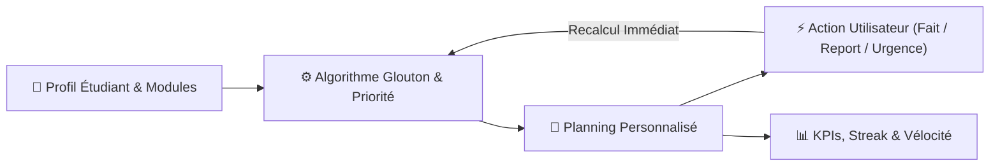
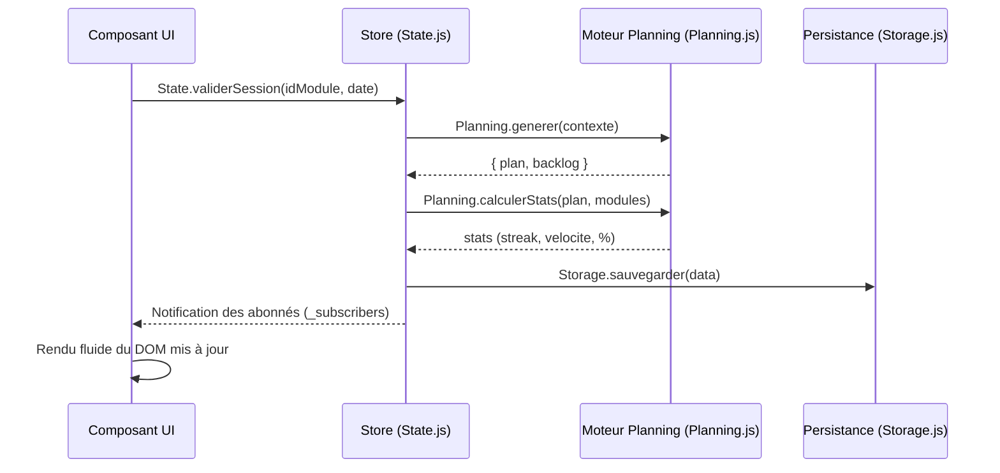

# RevisionFlow 📚

> **Planificateur de révisions intelligent, adaptatif et temps réel — 100 % exécuté côté client, zéro inscription, zéro dépendance serveur.**

[](README.md)
[]
[](https://developer.mozilla.org/fr/docs/Web/HTML)
[](https://developer.mozilla.org/fr/docs/Web/CSS)
[](https://developer.mozilla.org/fr/docs/Web/JavaScript)
[]
[](#persistance--migration-de-données)

---

## 📑 Sommaire

1. [Introduction & Vision](#-introduction--vision)
2. [Principes Fondateurs](#-principes-fondateurs)
3. [Architecture Fonctionnelle & Modules](#-architecture-fonctionnelle--modules)
   - [1. Assistant de Configuration (Wizard)](#1-assistant-de-configuration-wizard)
   - [2. Tableau de Bord Quotidien (Dashboard)](#2-tableau-de-bord-quotidien-dashboard)
   - [3. Moteur Pomodoro Haute Concentration](#3-moteur-pomodoro-haute-concentration)
   - [4. Module d'Historique & Analytique](#4-module-dhistorique--analytique)
4. [Fondements Mathématiques & Algorithme de Planification](#-fondements-mathématiques--algorithme-de-planification)
   - [4.1 Formule de Priorité Dynamique](#41-formule-de-priorité-dynamique)
   - [4.2 Principe d'Entrelacement Cognitif (Interleaving)](#42-principe-dentrelacement-cognitif-interleaving)
   - [4.3 Algorithme Glouton & Résolution des Égalités](#43-algorithme-glouton--résolution-des-égalités)
   - [4.4 Préservation du Passé & Détection du Backlog](#44-préservation-du-passé--détection-du-backlog)
5. [Architecture Technique & Modèle de Données](#-architecture-technique--modèle-de-données)
   - [Structure Globale du Projet](#structure-globale-du-projet)
   - [Pattern Store (State Management)](#pattern-store-state-management)
   - [Schéma du State](#schéma-du-state)
   - [Persistance & Migration de Données](#persistance--migration-de-données)
6. [Design System & Ergonomie Visuelle](#-design-system--ergonomie-visuelle)
7. [Installation & Déploiement Local](#-installation--déploiement-local)
8. [Tests & Validation](#-tests--validation)
9. [Intégration d'APIs Externes](#-intégration-dapis-externes)
10. [Raccourcis & Bonnes Pratiques d'Utilisation](#-raccourcis--bonnes-pratiques-dutilisation)
11. [Contexte Académique & Auteur](#-contexte-académique--auteur)
12. [Licence](#-licence)

---

## 🎯 Introduction & Vision

**RevisionFlow** est une plateforme web d'ingénierie d'études conçue pour éliminer la procrastination, la désorganisation et la surcharge cognitive chez les étudiants préparant des examens académiques ou concours sélectifs.

Contrairement aux outils traditionnels (agendas statiques, tableurs, listes de tâches figées) qui deviennent obsolètes dès le premier imprévu, RevisionFlow repose sur un **moteur de planification dynamique réactif**. À chaque action de l'étudiant (validation, report, modification d'horaire, ajout de matière), l'ensemble du planning futur est instantanément réajusté selon un modèle d'optimisation mathématique.



---

## 💡 Principes Fondateurs

| Pilier | Concrétisation Technique | Bénéfice Utilisateur |
|---|---|---|
| **🚀 Zéro Friction** | 100 % exécuté côté client dans le navigateur. Aucun compte requis, aucune base de données distante, pas de serveur d'application obligatoire. | Prise en main en 30 secondes, respect absolu de la vie privée. |
| **🔍 Transparence Totale** | Si le volume de révision dépasse la capacité physique avant la date d'examen, le système ne masque rien : les sessions excédentaires passent en **Backlog** explicite. | Prise de conscience immédiate, prévention du burn-out. |
| **⚡ Réactivité Temps Réel** | Pattern Store unifié (`State`) avec recalcul glouton automatique lors de toute mutation d'état. | Le planning s'adapte à la vie de l'étudiant, et non l'inverse. |
| **🧠 Apprentissage Entrelacé** | Pénalisation exponentielle des répétitions intra-journalières d'un même module ($P / 2^k$). | Maximisation de la rétention mémorielle à long terme (principe d'*Interleaving* validé en sciences cognitives). |

---

## 🧩 Architecture Fonctionnelle & Modules

### 1. Assistant de Configuration (Wizard)
L'assistant guide l'étudiant à travers un parcours interactif fluide en 3 étapes :
- **Étape 1 — Profil d'étude & Calendrier :**
  - Choix du type de rythme (*Fixe* pour planning rigoureux ou *Flexible* pour s'adapter au jour le jour).
  - Sélection du pays parmi une large liste de standards internationaux (France, Maroc, Belgique, Canada, Sénégal, etc.) pour la synchronisation automatique des jours fériés.
  - Définition de la date de démarrage des révisions.
- **Étape 2 — Modules & Examens :**
  - Ajout dynamique de matières avec nom, date de passage de l'épreuve, échelle de difficulté pondérée (1 à 5 étoiles) et nombre total de chapitres à réviser.
  - Attribution automatique d'une signature chromatique unique issue d'une palette accessible et contrastée.
- **Étape 3 — Capacités & Jours de Repos :**
  - Paramétrage fin des créneaux quotidiens (heures d'étude en soirée la semaine, volume horaire le week-end, durée standard d'une session).
  - Verrouillage interactif de jours de repos obligatoires (capacité forcée à 0).

---

### 2. Tableau de Bord Quotidien (Dashboard)

Le tableau de bord s'articule autour d'une barre de navigation supérieure, d'un bandeau de progression et d'un **Focus Board en 3 colonnes** :

| Colonne | Contenu |
|---|---|
| **À faire** | Les sessions du jour encore à réaliser, avec leur module et leur heure. |
| **Focus actuel** | Le module en cours (priorité dynamique, date d'examen), la minuterie Pomodoro intégrée, les notes rapides et l'action **Terminer la session**. |
| **Terminées** | Les sessions validées de la journée, avec leur horaire, leur éventuel bilan et la possibilité de les rouvrir. |

Le bandeau supérieur récapitule la progression : sessions faites / total, pourcentage, série, objectif quotidien, XP du jour et prochain examen.

#### Progression : XP, série et objectif quotidien

| Action | XP |
|---|---|
| Session terminée | **+10** |
| Bilan renseigné (niveau de maîtrise choisi) | **+15** |
| Note de bilan (texte non vide) | **+5** |
| **Objectif quotidien atteint** (toutes les sessions du jour terminées) | **+25** |

- La pastille **Objectif** affiche `n / m`, puis passe à « Objectif atteint » dès que toutes les sessions du jour sont terminées ; un toast unique confirme l'attribution du bonus.
- L'XP est **purement dérivé du planning** : il est recalculé à chaque affichage, jamais stocké, et ne peut donc pas être compté deux fois — y compris après un rechargement de la page.
- La **série** compte les journées consécutives dont toutes les sessions prévues sont terminées ; une journée incomplète aujourd'hui n'interrompt pas la comptabilisation des jours précédents.

#### Les Vues du Dashboard :
1. **Focus du jour (Aujourd'hui) :**
   - Bandeau de statistiques : sessions faites / total, progression, série, objectif quotidien, XP du jour, prochain examen.
   - Boutons d'action rapide : **Anticiper une session** (avance une session du lendemain si la capacité du jour le permet) et **Déclarer un jour libre** (bascule la journée en capacité week-end pour débloquer du retard).
   - Focus Board en 3 colonnes : **À faire**, **Focus actuel** (avec la minuterie intégrée), **Terminées**.
   - Après validation d'une session, un **bilan** est proposé : niveau de maîtrise (Facile / Moyen / À revoir) et note libre, avec possibilité d'annuler ou de rouvrir la carte sans double comptage.
   - Ruban d'alerte backlog réactif en cas de surcharge horaire.
2. **Vue Calendrier :**
   - Vue matricielle mensuelle avec navigation ergonomique (mois précédent/suivant).
   - Badges colorés par statut de journée : *À faire*, *Complété*, *Manqué*, *Repos / Off*, *Examen*.
   - Volet latéral rétractable affichant le détail des sessions de la journée sélectionnée.
   - Échéancier récapitulatif chronologique de l'ensemble des examens programmés.
3. **Vue Modules :**
   - Cartes synthétiques par matière avec barre de progression, pourcentage de complétion et score d'urgence dynamique.
   - Formulaire d'ajout rapide de nouveaux modules en cours de semestre sans réinitialiser le planning.
4. **Vue Paramètres :**
   - Ajustement dynamique des curseurs de capacité (soir, week-end, durée de session).
   - Sélecteur de pays avec rafraîchissement des jours fériés.
   - Bouton de bascule Mode Sombre / Mode Clair.
   - Outils de sauvegarde : Exportation JSON, Importation avec validation, et Réinitialisation totale sécurisée.

---

### 3. Moteur Pomodoro Haute Concentration
Intégré directement à la colonne **Focus actuel** du tableau de bord, sans rechargement ni changement de page :
- **Trois modes d'étude :** *Travail* (25 ou 50 min), *Petite Pause* (5 min), *Pause Longue* (15 min après 4 cycles).
- **Affichage :** compte à rebours numérique à chiffres tabulaires, avec le titre de l'onglet du navigateur mis à jour (`(24:59) RevisionFlow`).
- **Retour sonore :** génération acoustique via la **Web Audio API** native (oscillateur, sans fichier audio externe ni requête réseau).
- **Fin de session :** notification informative, bascule automatique vers la pause et incrément du compteur de sessions.
- **Persistance autonome :** l'état du chronomètre est conservé dans `localStorage` pour survivre à un rafraîchissement accidentel.

---

### 4. Module d'Historique & Analytique

Accessible depuis la barre latérale, la page d'historique garde une trace immuable des performances de l'étudiant :
- **Archivage automatique :** Sauvegarde des 5 derniers plannings finalisés ou réinitialisés.
- **Métriques conservées :** Taux de complétion final, Streak maximal atteint, et **Vélocité moyenne** (nombre de sessions validées par jour sur une fenêtre glissante de 72h).
- **Mode consultation :** Visualisation en lecture seule des sessions passées et des modules étudiés.

---

## 📐 Fondements Mathématiques & Algorithme de Planification

L'un des atouts majeurs de RevisionFlow réside dans son algorithme glouton déterministe avec entrelacement cognitif, implémenté sous forme de fonctions pures dans [`core/planning.js`](core/planning.js).

### 4.1 Formule de Priorité Dynamique
Chaque module $i$ reçoit à chaque instant $t$ un score de priorité brute $\mathcal{P}_i$ :

$$\mathcal{P}_i = (\text{Difficulté}_i \times \text{Chapitres Restants}_i) \times \left(1 + \frac{1}{\ln(\Delta t_i + 2)}\right)$$

Où :
- $\text{Difficulté}_i \in [1, 5]$ : pondération de l'effort cognitif requis.
- $\text{Chapitres Restants}_i$ : volume de travail encore non validé.
- $\Delta t_i = \max(0, \lceil (T_{\text{examen}, i} - T_{\text{actuel}}) / 86400000 \rceil)$ : nombre de jours restants avant l'épreuve.
- Le terme $\frac{1}{\ln(\Delta t_i + 2)}$ constitue un **facteur d'accélération logarithmique amorti** : la priorité augmente naturellement au fur et à mesure que l'échéance approche, tout en évitant une divergence asymptotique à $\Delta t = 0$.

```
Exemple comparatif :
----------------------------------------------------------------------
Module        Diff.  Chap.   Δt (jours)   Multiplicateur   Score Brut P
----------------------------------------------------------------------
Algèbre         4      6         4       1 + 1/ln(6) ≈ 1.558   37.4
Réseaux         3      5        10       1 + 1/ln(12) ≈ 1.402  21.0
Électronique    2      3        25       1 + 1/ln(27) ≈ 1.303   7.8
----------------------------------------------------------------------
```

---

### 4.2 Principe d'Entrelacement Cognitif (Interleaving)
Travailler 4 heures consécutives sur la même matière engendre une fatigue cognitive rapide et réduit le taux de mémorisation. Pour encourager l'alternance optimale des matières :

$$\mathcal{P}_{i, \text{jour}} = \frac{\mathcal{P}_i}{2^k}$$

Où $k$ représente le nombre de sessions du module $i$ **déjà attribuées au cours de la même journée**.

```
Exemple de distribution sur une journée à capacité de 3 sessions :
- Slot 1 : Algèbre (P=37.4, k=0) est sélectionné. Son k passe à 1.
- Slot 2 : Algèbre (P=37.4 / 2 = 18.7) vs Réseaux (P=21.0, k=0). Réseaux l'emporte ! k(Réseaux) passe à 1.
- Slot 3 : Algèbre (18.7) vs Réseaux (10.5) vs Électronique (7.8). Algèbre est sélectionné.
Résultat : Algèbre ➔ Réseaux ➔ Algèbre (alternance saine et productive).
```

---

### 4.3 Algorithme Glouton & Résolution des Égalités
Pour chaque journée chronologique du calendrier :
1. Calculer la capacité du jour selon la règle :
   $$\text{Capacité} = \begin{cases} 
   0 & \text{si jour bloqué} \\
   \text{heuresWeekend} & \text{si week-end, jour férié ou jour libre} \\
   \text{heuresSoir} & \text{en semaine standard}
   \end{cases}$$
2. Tant que $\text{créneaux attribués} < \text{Capacité}$ et qu'il reste des sessions non planifiées :
   - Évaluer $\mathcal{P}_{i, \text{jour}}$ pour tous les modules éligibles (modules dont la date d'examen est strictement postérieure au jour en cours).
   - Trier les candidats selon un ordre lexicographique déterministe strict :
     1. **Score $\mathcal{P}_{i, \text{jour}}$ décroissant**
     2. **Nombre de chapitres restants décroissant** *(en cas d'égalité de score)*
     3. **Ordre alphabétique du nom du module** *(en cas de parfaite parité)*
   - Assigner la session au premier module du tri et incrémenter son compteur $k$.

---

### 4.4 Préservation du Passé & Détection du Backlog
- **Immuabilité du Passé :** À chaque recalcul, tous les jours $\le T_{\text{aujourd'hui}}$ restent rigoureusement intacts. Cela garantit que votre historique de travail, votre série consécutive (*streak*) et votre vélocité ne sont jamais falsifiés rétrospectivement.
- **Gestion du Backlog :** Tout module dont les chapitres requis n'ont pas pu être programmés avant sa date d'examen est automatiquement comptabilisé dans la structure `backlog`. L'interface informe aussitôt l'utilisateur du nombre exact de sessions en péril, lui permettant de débloquer des jours libres ou d'augmenter son temps de travail du soir.

---

## 🏗️ Architecture Technique & Modèle de Données

### Structure Globale du Projet

```
RevisionFlow/
│
├── index.html                   # Redirection d'entrée vers la page d'accueil
├── favicon.svg                  # Icône du site (SVG inline, sans dépendance)
├── serve.py                     # Serveur HTTP local (force UTF-8 sur les réponses)
├── README.md                    # Documentation de référence du projet
│
├── landing/                     # Vitrine & page d'accueil
│   ├── index.html               # Présentation visuelle, pitch & navigation
│   ├── landing.css              # Styles vitrine, grille animée & responsive
│   └── landing.js               # Parallaxe, animations d'apparition & compteurs
│
├── core/                        # Cœur fonctionnel (JS pur & Design Tokens)
│   ├── variables.css            # Tokens CSS (couleurs, thèmes clair/sombre, typographie)
│   ├── state.js                 # Store central réactif (pattern Store)
│   ├── planning.js              # Fonctions pures de l'algorithme, statistiques, XP & série
│   ├── storage.js               # Persistance localStorage, export/import JSON
│   └── ui.js                    # Toasts, modales de confirmation & animations
│
├── components/                  # Composants modulaires d'interface
│   ├── wizard/                  # Assistant d'onboarding en 3 étapes
│   │   ├── wizard.html          # Structure de l'assistant
│   │   ├── wizard.css           # Mise en page des étapes, badges, sélecteurs
│   │   ├── wizard.js            # Contrôleur (navigation, validation)
│   │   └── wizard-view.js       # Rendu dynamique des formulaires de modules
│   │
│   ├── dashboard/               # Tableau de bord (Focus Board 3 colonnes)
│   │   ├── dashboard.html       # Structure (topbar, hero, Focus Board, modales)
│   │   ├── dashboard.css        # Styles (cartes, pastilles, calendrier, modales)
│   │   ├── dashboard.js         # Contrôleur, écouteurs, raccourcis clavier
│   │   └── dashboard-view.js    # Moteur de rendu (cartes, calendrier, compteurs)
│   │
│   └── pomodoro/                # Minuteur de concentration
│       ├── pomodoro.css         # Styles de la minuterie & contrôles
│       └── pomodoro.js          # Moteur temporel, Web Audio API & cycle de pause
│
├── history/                     # Module d'archives & statistiques
│   ├── index.html               # Page dédiée à l'historique des plannings
│   ├── history.css              # Styles des cartes d'archive et métriques
│   └── history.js               # Contrôleur d'extraction et affichage des archives
│
├── app/                         # Point d'accès applicatif & redirection
│   └── index.html               # Bootstrap rapide vers le dashboard
│
└── scratch/                     # Outillage de validation (hors production)
    ├── test-v32-xp.js           # Tests XP (E2E Chrome)
    ├── test-v34-goal.js         # Tests objectif quotidien +25 XP
    ├── validate-ds.js           # Validation Design System & contrat DOM
    └── audit-v35-runtime.js     # Audit runtime complet (Chrome CDP)
---

### Pattern Store (State Management)
L'état de l'application est géré dans [`core/state.js`](core/state.js) selon un flux unidirectionnel inspiré de Redux, sans dépendance externe :



Méthodes publiques exposées :
- `State.get()` : renvoie une copie profonde (*deep copy*) immuable de l'état.
- `State.update(changes)` : fusion récursive (`deepMerge`), recalcul automatique, sauvegarde et diffusion.
- `State.subscribe(callback)` : inscription d'un composant aux notifications de mise à jour.
- `State.planifier()` : déclenchement du moteur glouton et persistance.

---

### Schéma du State

```typescript
interface RevisionFlowState {
  palette: string[];                  // Liste des codes hexadécimaux attribués aux modules
  profil: {
    type: 'fixe' | 'flexible' | null; // Profil d'étude
    configFait: boolean;              // Indique si le wizard initial a été complété
  };
  config: {
    dateDebut: string;                // Date de départ (YYYY-MM-DD)
    heuresSoir: number;               // Capacité horaire en soirée (ex: 2h)
    heuresWeekend: number;            // Capacité horaire le week-end (ex: 6h)
    dureeSession: number;             // Durée unitaire d'un créneau (ex: 1h)
    joursBlockes: string[];           // Dates de repos forcé (YYYY-MM-DD)
    joursLibres: string[];            // Dates manuelles à haute capacité (YYYY-MM-DD)
  };
  pays: string;                       // Code ISO-3166-1 alpha-2 (ex: "MA", "FR")
  joursFeries: string[];              // Dates fériées issues de Nager.Date
  modules: Array<{
    id: string;                       // Identifiant unique
    nom: string;                      // Nom de la matière
    etoiles: number;                  // Difficulté (1 à 5)
    chapitres: number;                // Volume total de sessions
    dateExam: string;                 // Date d'examen (YYYY-MM-DD)
    sessionsValidees: number;         // Nombre de sessions complétées
    couleur: string;                  // Couleur CSS associée
  }>;
  plan: Array<{
    date: string;                     // Date du jour (YYYY-MM-DD)
    type: 'soir' | 'weekend' | 'libre' | 'off';
    heuresDispo: number;              // Capacité en heures
    statut: 'todo' | 'off' | 'done';
    sessions: Array<{
      id: string;                     // Identifiant unique de session
      moduleId: string;               // Référence au module
      nom: string;                    // Nom du module
      date: string;                   // Date programmée
      dureeH: number;                 // Durée (1h standard)
      faite: boolean;                 // Statut de validation
      statut: 'en_attente' | 'termine';
      scoreSnapshot: number;          // Valeur du score au moment du calcul
    }>;
  }>;
  backlog: Array<{
    moduleId: string;
    sessions: number;                 // Nombre de sessions non programmables
  }>;
  stats: {
    totalSessions: number;
    sessionsFaites: number;
    joursRestants: number;
    pourcentage: number;
    velocite: number;                 // Sessions/jour sur les 3 derniers jours
    streak: number;                   // Jours consécutifs d'études
    xpTotal: number;                    // XP cumulés toutes sessions confondues
    xpAujourdhui: number;               // XP gagnés aujourd'hui
    xpObjectifsQuotidiens: number;      // Bonus d'objectif quotidien cumulés (+25 / jour)
    objectifsAtteints: number;           // Nombre de jours où l'objectif a été atteint
  };
  notes: Record<string, string>;      // Notes personnelles indexées par session
  historique: Array<any>;             // Archives des 5 précédents plannings
  prefs: {
    filtre: { statut: string; module: string; semaine: string | null };
    theme: 'light' | 'dark';          // Thème visuel actif
  };
}
```

---

### Persistance & Migration de Données
- **Clef Locale :** Toutes les données de l'application sont enregistrées sous la clef `revisionflow_data` via l'API standard `localStorage`.
- **Mécanisme de Deep Merge :** À chaque ouverture, la fonction `deepMerge(initial, saved)` comble automatiquement les éventuelles clefs manquantes dans une ancienne sauvegarde par les valeurs par défaut de la nouvelle version logicielle, évitant tout plantage d'incompatibilité.
- **Export / Import JSON :** L'utilisateur peut à tout instant exporter un instantané complet (`revisionflow-YYYY-MM-DD.json`) et le réimporter sur un autre appareil en un clic.

---

## 🎨 Design System & Ergonomie Visuelle

Le fichier central [`core/variables.css`](core/variables.css) définit l'intégralité des Design Tokens du projet :
- **Typographie :**
  - Titres et Chiffres : **Bricolage Grotesque** (expressif, géométrique, moderne).
  - Corps de texte et UI : **Plus Jakarta Sans** (haute lisibilité, optimisé pour les interfaces denses).
  - Chronomètre Pomodoro : Police monospace native avec alignement tabulaire des chiffres.
- **Palette Chromatique :**
  - **Palette Sémantique (Design System V3) :** chaque couleur porte un rôle explicite, décliné via des tokens dédiés dans `core/variables.css`.
    - **Primaire — Indigo** (`--color-primary`) : identité, actions et sélection.
    - **Succès — Émeraude** (`--color-success`) : validation et progression.
    - **Attention — Orange** (`--color-attention`) et **Ambre** (`--color-amber`) : urgences et maîtrise partielle.
    - **Danger — Corail** (`--color-danger`) : échéances imminentes et suppressions.
    - **Récompense — Or** (`--color-reward`) : réservée à l'XP et aux paliers de série.
---

## 🚀 Installation & Déploiement Local

RevisionFlow ne nécessite aucun environnement d'exécution particulier côté serveur. Cependant, pour éviter les restrictions de sécurité du navigateur sur certains appels asynchrones (CORS / `fetch`), **l'utilisation d'un serveur HTTP local statique est vivement recommandée**.

### Option A : Avec le serveur fourni (Recommandé)
```bash
# 1. Cloner ou télécharger le dépôt
git clone https://github.com/Godwin-08/RevisionFlow.git
cd RevisionFlow

# 2. Lancer le serveur HTTP local
python serve.py
```
👉 Ouvrez votre navigateur sur **[http://localhost:8080](http://localhost:8080)**

> ⚠️ **Pourquoi ce script plutôt que `python -m http.server` ?** Le serveur standard ne précise pas l'encodage des réponses `text/*`. Le navigateur bascule alors sur Latin-1 et **corrompt tous les caractères accentués** de l'interface. `serve.py` force `charset=utf-8` sur toutes les réponses.

### Option B : Avec Node.js & npx
```bash
# Dans le dossier RevisionFlow :
npx serve -l 8080 .
```
👉 Ouvrez votre navigateur sur **[http://localhost:8080](http://localhost:8080)**

---

### Option C : Avec PHP
```bash
php -S localhost:8080
```

---

### Option D : Avec VS Code (Live Server)
1. Installez l'extension **Live Server** (`ritwickdey.LiveServer`).
2. Faites un clic droit sur le fichier racine [`index.html`](index.html) ou [`landing/index.html`](landing/index.html).
3. Cliquez sur **« Open with Live Server »**.

---

## 🧪 Tests & Validation

Quatre suites sont conservées dans [`scratch/`](scratch) (hors production, aucune n'est chargée par l'application).

| Suite | Exécution | Couverture |
|---|---|---|
| `test-v34-goal.js` | `node scratch/test-v34-goal.js` | Objectif quotidien +25 XP, XP session/bilan/note, non-régression streak, persistance (68 assertions) |
| `validate-ds.js` | `node scratch/validate-ds.js` | Tokens définis/utilisés, couleurs en dur, contrat DOM, encodage, ressources du dashboard |
| `test-v32-xp.js` | Chrome en `--remote-debugging-port=9222` puis `node scratch/test-v32-xp.js` | XP de bout en bout, bilan, F5, responsive (9 tests) |
| `audit-v35-runtime.js` | `python serve.py` + Chrome en `--remote-debugging-port=9222` puis `node scratch/audit-v35-runtime.js` | Audit runtime complet : métadonnées, réseau, console, contraste, accessibilité, responsive, navigation, modales, Pomodoro, états, et **auto-test de falsification du harnais** |

> 💡 Pour lancer l'audit runtime, ouvrez le dashboard dans le Chrome de debug, puis exécutez le script. Il distingue explicitement **PASS**, **FAIL**, **N/A** et **INFO** : un `FAIL` reste toujours bloquant.

---

## 🌐 Intégration d'APIs Externes

| Service | Fournisseur | Rôle dans l'application | Endpoint exploité |
|---|---|---|---|
| **Nager.Date API** | [date.nager.at](https://date.nager.at) | Détection automatique des jours fériés légaux selon le pays de l'étudiant pour surclasser automatiquement ces journées en haute capacité d'étude. | `GET https://date.nager.at/api/v3/PublicHolidays/{year}/{countryCode}` |
| **Web Audio API** | Navigateur W3C | Génération d'un carillon de fin de Pomodoro pur et agréable via oscillateur d'ondes sonores (aucune requête réseau requise). | `window.AudioContext` / `ctx.createOscillator()` |
| **Google Fonts** | Google Fonts CDN | Feuilles de styles typographiques légères pour le rendu esthétique des polices *Bricolage Grotesque* et *Plus Jakarta Sans*. | `fonts.googleapis.com` |

---

## ⚡ Raccourcis & Bonnes Pratiques d'Utilisation

> [!TIP]
> **Planifier vos examens les plus ardus en premier :** La formule de priorité prend en compte le carré implicite de l'effort ($\text{Difficulté} \times \text{Chapitres}$). Attribuez 4 ou 5 étoiles aux matières à fort coefficient ou à fort volume de cours pour garantir leur alternance dès les premières semaines.

> [!NOTE]
> **Déclarer un jour libre en cas de retard :** Si vous avez accumulé du retard suite à un contretemps, cliquez simplement sur le bouton **« Déclarer jour libre »** sur la journée d'aujourd'hui : l'algorithme débloquera instantanément le volume d'heures du week-end pour éponger le backlog sans bousculer vos jours futurs.

> [!IMPORTANT]
> **Sauvegardez régulièrement vos données :** Rendez-vous dans l'onglet **Paramètres** et cliquez sur **Exporter**. Vous obtiendrez un fichier JSON horodaté que vous pourrez archiver ou transférer sur un autre navigateur.

---

## 🎓 Contexte Académique & Auteur

Ce projet a été imaginé, conçu et développé dans un cadre académique d'excellence :

- **Auteur :** NOUGBOLO Godwin Elie
- **Filière :** Ingénierie Informatique et Technologies Émergentes (IID1)
- **Établissement :** École Nationale des Sciences Appliquées de Khouribga (ENSA Khouribga)
- **Encadrante Universitaire :** Pr. RABHI Loubna
- **Année Académique :** 2025 – 2026

---

## 📄 Licence

Ce logiciel est distribué sous les termes de la licence libre **MIT**. Vous êtes libre de l'utiliser, le modifier et de l'adapter pour vos besoins personnels et pédagogiques.

9. [Tests & Validation](#-tests--validation)
