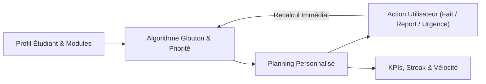
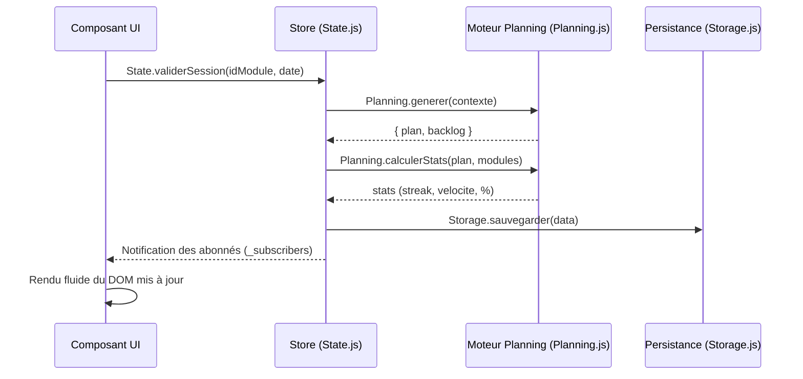

# RevisionFlow

> **Planificateur de révisions intelligent, adaptatif et temps réel — 100 % exécuté côté client, zéro inscription, zéro dépendance serveur.**

[](README.md)
[]
[](https://developer.mozilla.org/fr/docs/Web/HTML)
[](https://developer.mozilla.org/fr/docs/Web/CSS)
[](https://developer.mozilla.org/fr/docs/Web/JavaScript)
[]
[](#comment-les-données-sont-gardées)

---

## Sommaire

1. [Introduction](#introduction)
2. [Nos 4 principes](#nos-4-principes)
3. [Ce que fait l'application](#ce-que-fait-lapplication)
   - [1. L'assistant de configuration (Wizard)](#1-lassistant-de-configuration-wizard)
   - [2. Le tableau de bord (Dashboard)](#2-le-tableau-de-bord-dashboard)
   - [3. Le minuteur Pomodoro](#3-le-minuteur-pomodoro)
   - [4. L'historique](#4-lhistorique)
4. [Comment le planning est calculé](#comment-le-planning-est-calculé)
   - [4.1 Le score de priorité](#41-le-score-de-priorité)
   - [4.2 L'alternance entre les matières](#42-lalternance-entre-les-matières)
   - [4.3 Le calcul, jour par jour](#43-le-calcul-jour-par-jour)
   - [4.4 Le passé ne change pas + le backlog](#44-le-passé-ne-change-pas--le-backlog)
5. [Comment c'est construit](#comment-cest-construit)
   - [Les fichiers du projet](#les-fichiers-du-projet)
   - [Le store (State)](#le-store-state)
   - [Les données de l'application](#les-données-de-lapplication)
   - [Comment les données sont gardées](#comment-les-données-sont-gardées)
6. [Le design de l'application](#le-design-de-lapplication)
7. [Installer et lancer le projet](#installer-et-lancer-le-projet)
8. [Tests & validation](#tests--validation)
9. [Services externes utilisés](#services-externes-utilisés)
10. [Conseils d'utilisation](#conseils-dutilisation)
11. [À propos de l'auteur](#à-propos-de-lauteur)
12. [Licence](#licence)

---

## Introduction

**RevisionFlow** est une application web qui aide les étudiants à réviser pour leurs examens.

Les outils habituels (agendas, tableurs, listes de tâches) deviennent faux dès qu'un imprévu arrive. RevisionFlow utilise un **moteur de calcul qui se recalcule tout seul**. Dès que tu valides une session ou que tu changes un horaire, tout le planning futur est recalculé.



---

## Nos 4 principes

| Principe | Comment ça marche | Ce que ça t'apporte |
|---|---|---|
| **Zéro contrainte** | Tout tourne dans ton navigateur. Pas de compte, pas de serveur, pas de base de données en ligne. | Tu commences en 30 secondes. Tes données restent sur ton ordinateur. |
| **On te dit tout** | Si tu n'as pas assez de temps avant un examen, l'application ne cache rien. Les sessions en trop vont dans le **backlog**. | Tu vois le problème tout de suite. Tu évites le burn-out (l'épuisement). |
| **Tout est instantané** | Un store unique (`State`) recalcule tout dès que quelque chose change. | Le planning suit ta vie, et pas l'inverse. |
| **On alterne les matières** | Une matière déjà traitée dans la journée est pénalisée : son score est divisé par $2^k$. | Tu retiens mieux sur la durée. C'est le principe de l'*interleaving* (alternance). |

---

## Ce que fait l'application

### 1. L'assistant de configuration (Wizard)

L'assistant te guide en 3 étapes. Tu réponds à quelques questions, et l'application construit ton planning.

- **Étape 1 — Ton rythme et le calendrier :**
  - Tu choisis un rythme : *Fixe* (un planning rigide) ou *Flexible* (tu t'adaptes selon les jours).
  - Tu choisis ton pays (France, Maroc, Belgique, Canada, Sénégal…) pour ajouter automatiquement les jours fériés.
  - Tu choisis la date de début de tes révisions.
- **Étape 2 — Tes matières et tes examens :**
  - Tu ajoutes tes matières : nom, date de l'examen, difficulté (de 1 à 5 étoiles) et nombre de chapitres.
  - Chaque matière reçoit automatiquement une couleur.
- **Étape 3 — Tes horaires et tes jours de repos :**
  - Tu définis tes horaires : heures d'étude le soir en semaine, heures le week-end, durée d'une session.
  - Tu bloques des jours de repos (capacité forcée à 0).

---

### 2. Le tableau de bord (Dashboard)

Le tableau de bord a une barre de navigation en haut, un bandeau qui montre ta progression, et un **Focus Board en 3 colonnes** :

| Colonne | Ce qu'on y trouve |
|---|---|
| **À faire** | Les sessions du jour qu'il te reste à faire, avec la matière et l'heure. |
| **Focus actuel** | La matière en cours (priorité, date d'examen), le minuteur Pomodoro, les notes rapides et le bouton **Terminer la session**. |
| **Terminées** | Les sessions validées du jour, avec l'heure, le bilan, et la possibilité de les rouvrir. |

Le bandeau du haut résume ta progression : sessions faites / total, pourcentage, série, objectif du jour, XP du jour et prochain examen.

#### L'XP, la série et l'objectif du jour

| Action | XP |
|---|---|
| Session terminée | **+10** |
| Bilan rempli (tu choisis le niveau de maîtrise) | **+15** |
| Note de bilan (texte non vide) | **+5** |
| **Objectif du jour atteint** (toutes les sessions du jour sont terminées) | **+25** |

- La pastille **Objectif** montre `n / m`, puis passe à « Objectif atteint » quand toutes les sessions du jour sont finies. Un message unique confirme le bonus.
- L'XP est **calculé à partir du planning** : il est recalculé à chaque affichage et n'est jamais stocké. Il ne peut donc pas être compté deux fois, même après un rechargement de la page.
- La **série** compte les jours où toutes les sessions prévues sont terminées. Si aujourd'hui n'est pas fini, les jours précédents restent comptés.

#### Les vues du tableau de bord

1. **Focus du jour :**
   - Le bandeau de statistiques (sessions, progression, série, objectif, XP, prochain examen).
   - Deux boutons rapides : **Anticiper une session** (avance une session de demain si tu as le temps) et **Déclarer un jour libre** (la journée passe en capacité week-end pour rattraper le retard).
   - Le Focus Board en 3 colonnes : **À faire**, **Focus actuel** (avec le minuteur), **Terminées**.
   - Après une session validée, l'application te propose un **bilan** : niveau de maîtrise (Facile / Moyen / À revoir) et une note libre. Tu peux annuler ou rouvrir la carte sans double comptage.
   - Un bandeau d'alerte s'affiche quand tu as trop de travail pour le temps disponible.
2. **Vue Calendrier :**
   - Un calendrier mensuel. Tu passes au mois précédent ou suivant.
   - Une couleur par statut : *À faire*, *Complété*, *Manqué*, *Repos*, *Examen*.
   - Un panneau qui montre le détail du jour que tu choisis.
   - La liste de tous tes examens, dans l'ordre des dates.
3. **Vue Modules :**
   - Une carte par matière, avec une barre de progression et un score d'urgence.
   - Un formulaire pour ajouter une matière pendant le semestre, sans casser le planning.
4. **Vue Paramètres :**
   - Des curseurs pour changer tes horaires (soir, week-end, durée d'une session).
   - Le choix du pays, avec mise à jour des jours fériés.
   - Le bouton pour passer du mode sombre au mode clair.
   - Les outils de sauvegarde : export JSON, import avec vérification, et réinitialisation complète.

---

### 3. Le minuteur Pomodoro

Le minuteur se trouve dans la colonne **Focus actuel** du tableau de bord. Pas besoin de changer de page.

- **Trois modes :** *Travail* (25 ou 50 min), *Petite pause* (5 min), *Pause longue* (15 min après 4 cycles).
- **Affichage :** un compte à rebours en chiffres. Le titre de l'onglet change aussi (`(24:59) RevisionFlow`).
- **Son :** un petit son généré par le navigateur (Web Audio API). Pas de fichier audio à télécharger.
- **Fin de session :** un message s'affiche, le minuteur passe en pause, et le compteur de sessions augmente.
- **Sauvegarde :** le minuteur est gardé dans `localStorage`. Si tu rafraîchis la page par erreur, il continue.

---

### 4. L'historique

La page d'historique garde une trace de tes résultats. Elle est en lecture seule : tu ne peux rien modifier.

- **Sauvegarde automatique :** les 5 derniers plannings (quand tu les termines ou que tu réinitialises).
- **Données gardées :** le taux de complétion final, la meilleure série, et la **vélocité moyenne** (sessions validées par jour sur les 3 derniers jours).
- **Consultation :** tu peux revoir tes anciennes sessions et tes matières.

---

## Comment le planning est calculé

Le cœur de RevisionFlow est un algorithme. Il place les sessions une par une et prend toujours la matière la plus urgente. Tout est écrit dans [`core/planning.js`](core/planning.js), sous forme de fonctions pures : elles ne changent rien en dehors d'elles-mêmes.

### 4.1 Le score de priorité

Chaque module $i$ reçoit un score de priorité $\mathcal{P}_i$ :

$$\mathcal{P}_i = (\text{Difficulté}_i \times \text{Chapitres Restants}_i) \times \left(1 + \frac{1}{\ln(\Delta t_i + 2)}\right)$$

Avec :
- $\text{Difficulté}_i \in [1, 5]$ : le nombre d'étoiles. Plus c'est haut, plus la matière est lourde.
- $\text{Chapitres Restants}_i$ : le nombre de chapitres qu'il reste à faire.
- $\Delta t_i = \max(0, \lceil (T_{\text{examen}, i} - T_{\text{actuel}}) / 86400000 \rceil)$ : le nombre de jours avant l'examen.
- $\frac{1}{\ln(\Delta t_i + 2)}$ : un petit bonus qui monte quand l'examen approche. Il ne devient jamais infini, même le dernier jour.

```
Exemple :
----------------------------------------------------------------------
Module        Étoiles  Chap.   Jours   Bonus          Score P
----------------------------------------------------------------------
Algèbre         4      6        4      1 + 1/ln(6)  ≈ 1.558   37.4
Réseaux         3      5       10      1 + 1/ln(12) ≈ 1.402   21.0
Électronique    2      3       25      1 + 1/ln(27) ≈ 1.303    7.8
----------------------------------------------------------------------
```

---

### 4.2 L'alternance entre les matières

Studier 4 heures d'affilée la même matière fatigue vite, et on retient moins. Pour mélanger les matières, l'application applique cette règle :

$$\mathcal{P}_{i, \text{jour}} = \frac{\mathcal{P}_i}{2^k}$$

$k$ = le nombre de sessions de la matière $i$ déjà placées **au cours de la même journée**.

```
Exemple sur une journée de 3 sessions :
- Créneau 1 : Algèbre (P=37.4, k=0) est choisi. Son k passe à 1.
- Créneau 2 : Algèbre (37.4 / 2 = 18.7) contre Réseaux (21.0, k=0). Réseaux gagne ! k passe à 1.
- Créneau 3 : Algèbre (18.7) contre Réseaux (10.5) contre Électronique (7.8). Algèbre est choisi.
Résultat : Algèbre → Réseaux → Algèbre (les matières s'alternent).
```

---

### 4.3 Le calcul, jour par jour

Pour chaque jour du calendrier :
1. On calcule la capacité du jour :
   $$\text{Capacité} = \begin{cases} 
   0 & \text{si jour bloqué} \\
   \text{heuresWeekend} & \text{si week-end, jour férié ou jour libre} \\
   \text{heuresSoir} & \text{en semaine standard}
   \end{cases}$$
2. Tant qu'il reste de la place et des sessions à placer :
   - On calcule $\mathcal{P}_{i, \text{jour}}$ pour chaque module éligible (dont l'examen est après ce jour).
   - On trie les modules. L'ordre est toujours le même (c'est déterministe) :
     1. **Score $\mathcal{P}_{i, \text{jour}}$ : du plus grand au plus petit**
     2. **Nombre de chapitres restants : du plus grand au plus petit** *(si les scores sont égaux)*
     3. **Ordre alphabétique du nom du module** *(si c'est encore égal)*
   - On place la session sur le premier module du tri, et on augmente son compteur $k$.

---

### 4.4 Le passé ne change pas + le backlog

- **Le passé ne bouge jamais :** quand l'application recalcule, tous les jours $\le T_{\text{aujourd'hui}}$ restent exactement comme avant. Ton historique, ta série et ta vélocité ne peuvent donc jamais être faussés après coup.
- **Le backlog :** si un module n'a pas pu placer tous ses chapitres avant son examen, il est compté dans `backlog`. L'application te dit tout de suite combien de sessions sont en danger. Tu peux alors libérer un jour ou augmenter tes heures le soir.

---

## Comment c'est construit

### Les fichiers du projet

```
RevisionFlow/
│
├── index.html                   # Redirection d'entrée vers la page d'accueil
├── favicon.svg                  # Icône du site (SVG inline, sans dépendance)
├── serve.py                     # Serveur HTTP local (force UTF-8 sur les réponses)
├── README.md                    # Documentation de référence du projet
│
├── landing/                     # Vitrine & page d'accueil
│   ├── index.html               # Présentation visuelle, pitch & navigation
│   ├── landing.css              # Styles vitrine, grille animée & responsive
│   └── landing.js               # Parallaxe, animations d'apparition & compteurs
│
├── core/                        # Cœur fonctionnel (JS pur & Design Tokens)
│   ├── variables.css            # Tokens CSS (couleurs, thèmes clair/sombre, typographie)
│   ├── state.js                 # Store central réactif (pattern Store)
│   ├── planning.js              # Fonctions pures de l'algorithme, statistiques, XP & série
│   ├── storage.js               # Persistance localStorage, export/import JSON
│   └── ui.js                    # Toasts, modales de confirmation & animations
│
├── components/                  # Composants modulaires d'interface
│   ├── wizard/                  # Assistant d'onboarding en 3 étapes
│   │   ├── wizard.html          # Structure de l'assistant
│   │   ├── wizard.css           # Mise en page des étapes, badges, sélecteurs
│   │   ├── wizard.js            # Contrôleur (navigation, validation)
│   │   └── wizard-view.js       # Rendu dynamique des formulaires de modules
│   │
│   ├── dashboard/               # Tableau de bord (Focus Board 3 colonnes)
│   │   ├── dashboard.html       # Structure (topbar, hero, Focus Board, modales)
│   │   ├── dashboard.css        # Styles (cartes, pastilles, calendrier, modales)
│   │   ├── dashboard.js         # Contrôleur, écouteurs, raccourcis clavier
│   │   └── dashboard-view.js    # Moteur de rendu (cartes, calendrier, compteurs)
│   │
│   └── pomodoro/                # Minuteur de concentration
│       ├── pomodoro.css         # Styles de la minuterie & contrôles
│       └── pomodoro.js          # Moteur temporel, Web Audio API & cycle de pause
│
├── history/                     # Module d'archives & statistiques
│   ├── index.html               # Page dédiée à l'historique des plannings
│   ├── history.css              # Styles des cartes d'archive et métriques
│   └── history.js               # Contrôleur d'extraction et affichage des archives
│
├── app/                         # Point d'accès applicatif & redirection
│   └── index.html               # Bootstrap rapide vers le dashboard
│
└── scratch/                     # Outillage de validation (hors production)
    ├── test-v32-xp.js           # Tests XP (E2E Chrome)
    ├── test-v34-goal.js         # Tests objectif quotidien +25 XP
    ├── validate-ds.js           # Validation Design System & contrat DOM
    └── audit-v35-runtime.js     # Audit runtime complet (Chrome CDP)
---

### Le store (State)

Toutes les données de l'application sont dans un seul endroit : [`core/state.js`](core/state.js). Le principe est simple : un seul sens de circulation, comme dans Redux, et aucune bibliothèque extérieure.



Les 4 méthodes publiques :
- `State.get()` : renvoie une copie complète de l'état. La copie ne peut pas être modifiée par erreur.
- `State.update(changes)` : fusionne les changements, relance le calcul, sauvegarde et prévient les autres composants.
- `State.subscribe(callback)` : dit à un composant « préviens-moi quand l'état change ».
- `State.planifier()` : lance l'algorithme de placement et sauvegarde le résultat.

---

### Les données de l'application


```typescript
interface RevisionFlowState {
  palette: string[];                  // Liste des codes hexadécimaux attribués aux modules
  profil: {
    type: 'fixe' | 'flexible' | null; // Profil d'étude
    configFait: boolean;              // Indique si le wizard initial a été complété
  };
  config: {
    dateDebut: string;                // Date de départ (YYYY-MM-DD)
    heuresSoir: number;               // Capacité horaire en soirée (ex: 2h)
    heuresWeekend: number;            // Capacité horaire le week-end (ex: 6h)
    dureeSession: number;             // Durée unitaire d'un créneau (ex: 1h)
    joursBlockes: string[];           // Dates de repos forcé (YYYY-MM-DD)
    joursLibres: string[];            // Dates manuelles à haute capacité (YYYY-MM-DD)
  };
  pays: string;                       // Code ISO-3166-1 alpha-2 (ex: "MA", "FR")
  joursFeries: string[];              // Dates fériées issues de Nager.Date
  modules: Array<{
    id: string;                       // Identifiant unique
    nom: string;                      // Nom de la matière
    etoiles: number;                  // Difficulté (1 à 5)
    chapitres: number;                // Volume total de sessions
    dateExam: string;                 // Date d'examen (YYYY-MM-DD)
    sessionsValidees: number;         // Nombre de sessions complétées
    couleur: string;                  // Couleur CSS associée
  }>;
  plan: Array<{
    date: string;                     // Date du jour (YYYY-MM-DD)
    type: 'soir' | 'weekend' | 'libre' | 'off';
    heuresDispo: number;              // Capacité en heures
    statut: 'todo' | 'off' | 'done';
    sessions: Array<{
      id: string;                     // Identifiant unique de session
      moduleId: string;               // Référence au module
      nom: string;                    // Nom du module
      date: string;                   // Date programmée
      dureeH: number;                 // Durée (1h standard)
      faite: boolean;                 // Statut de validation
      statut: 'en_attente' | 'termine';
      scoreSnapshot: number;          // Valeur du score au moment du calcul
    }>;
  }>;
  backlog: Array<{
    moduleId: string;
    sessions: number;                 // Nombre de sessions non programmables
  }>;
  stats: {
    totalSessions: number;
    sessionsFaites: number;
    joursRestants: number;
    pourcentage: number;
    velocite: number;                 // Sessions/jour sur les 3 derniers jours
    streak: number;                   // Jours consécutifs d'études
    xpTotal: number;                    // XP cumulés toutes sessions confondues
    xpAujourdhui: number;               // XP gagnés aujourd'hui
    xpObjectifsQuotidiens: number;      // Bonus d'objectif quotidien cumulés (+25 / jour)
    objectifsAtteints: number;           // Nombre de jours où l'objectif a été atteint
  };
  notes: Record<string, string>;      // Notes personnelles indexées par session
  historique: Array<any>;             // Archives des 5 précédents plannings
  prefs: {
    filtre: { statut: string; module: string; semaine: string | null };
    theme: 'light' | 'dark';          // Thème visuel actif
  };
}
```

---

### Comment les données sont gardées

- **Tout est sur ton appareil :** les données sont enregistrées sous la clef `revisionflow_data` dans `localStorage` (le stockage du navigateur). Rien n'est envoyé sur Internet.
- **Pas de plantage au changement de version :** à chaque ouverture, la fonction `deepMerge(initial, saved)` rajoute les clés manquantes d'une ancienne sauvegarde avec les valeurs par défaut. Tu ne perds donc jamais tes données.
- **Export / Import JSON :** tu peux exporter une sauvegarde complète (`revisionflow-YYYY-MM-DD.json`) et la réimporter sur un autre appareil en un clic.

---

## Le design de l'application

Tout le style est regroupé dans un seul fichier : [`core/variables.css`](core/variables.css). On y trouve tous les « tokens », c'est-à-dire les variables qui définissent les couleurs, les polices et les espaces.

- **Les polices :**
  - Titres et chiffres : **Bricolage Grotesque** (forte, moderne).
  - Texte et interface : **Plus Jakarta Sans** (très lisible, même quand l'écran est chargé).
  - Minuteur Pomodoro : une police à chasse fixe, pour que les chiffres ne bougent pas de place.
- **Les couleurs :** chaque couleur a un rôle précis, avec un token dédié dans `core/variables.css`.
  - **Primaire — Indigo** (`--color-primary`) : l'identité, les boutons, la sélection.
  - **Succès — Émeraude** (`--color-success`) : ce qui est validé, et la progression.
  - **Attention — Orange** (`--color-attention`) et **Ambre** (`--color-amber`) : les urgences.
  - **Danger — Corail** (`--color-danger`) : les échéances proches et les suppressions.
  - **Récompense — Or** (`--color-reward`) : réservé à l'XP et aux paliers de série.
- **Mode clair et mode sombre :** les deux sont prévus d'origine. Le thème change avec l'attribut `data-theme="dark"` sur la balise `<html>`.
- **Pas de bibliothèque d'icônes :** tous les pictogrammes sont des **SVG dessinés directement dans le code**. Ils ne pèsent presque rien.
- **Adapté aux petits écrans :** le même code fonctionne de 320 px à plus de 1280 px de large.

---

## Installer et lancer le projet

RevisionFlow n'a besoin d'aucun serveur d'application. Pour éviter les blocages du navigateur (CORS, `fetch`), on conseille quand même d'utiliser un petit serveur HTTP local.

### Option A : avec le serveur fourni (recommandé)
```bash
# 1. Cloner ou télécharger le dépôt
git clone https://github.com/Godwin-08/RevisionFlow.git
cd RevisionFlow

# 2. Lancer le serveur HTTP local
python serve.py
```
Ouvrez votre navigateur sur **[http://localhost:8080](http://localhost:8080)**

> **Pourquoi ce script et pas `python -m http.server` ?** Le serveur standard ne dit pas au navigateur quel encodage utiliser pour les fichiers `text/*`. Le navigateur bascule alors en Latin-1, et **tous les accents de l'interface deviennent faux**. `serve.py` force `charset=utf-8`.

### Option B : avec Node.js et npx
```bash
# Dans le dossier RevisionFlow :
npx serve -l 8080 .
```
Ouvrez votre navigateur sur **[http://localhost:8080](http://localhost:8080)**

---

### Option C : avec PHP
```bash
php -S localhost:8080
```

---

### Option D : avec VS Code (Live Server)
1. Installez l'extension **Live Server** (`ritwickdey.LiveServer`).
2. Faites un clic droit sur le fichier racine [`index.html`](index.html) ou [`landing/index.html`](landing/index.html).
3. Cliquez sur **« Open with Live Server »**.

---

## Tests & validation

Quatre suites de tests sont gardées dans [`scratch/`](scratch). L'application ne les charge jamais.

| Suite | Comment la lancer | Ce qu'elle vérifie |
|---|---|---|
| `test-v34-goal.js` | `node scratch/test-v34-goal.js` | L'objectif du jour (+25 XP), l'XP de session / bilan / note, la non-régression de la série, la sauvegarde (68 vérifications) |
| `validate-ds.js` | `node scratch/validate-ds.js` | Les tokens, les couleurs en dur, le contrat du DOM, l'encodage, les fichiers du tableau de bord |
| `test-v32-xp.js` | Chrome lancé avec `--remote-debugging-port=9222`, puis `node scratch/test-v32-xp.js` | L'XP de bout en bout, le bilan, le rechargement de la page, l'adaptation aux petits écrans (9 tests) |
| `audit-v35-runtime.js` | `python serve.py` + Chrome avec `--remote-debugging-port=9222`, puis `node scratch/audit-v35-runtime.js` | Un audit complet : métadonnées, réseau, console, contraste, accessibilité, écrans, navigation, modales, Pomodoro, états. Il sépare bien **PASS**, **FAIL**, **N/A** et **INFO** |

> Pour lancer l'audit, ouvre le tableau de bord dans la fenêtre Chrome de debug, puis lance le script. Un **FAIL** reste toujours bloquant.

---

## Services externes utilisés

| Service | Fournisseur | Rôle | Lien utilisé |
|---|---|---|---|
| **Nager.Date API** | [date.nager.at](https://date.nager.at) | Trouve les jours fériés de ton pays. Ces jours sont traités comme des jours à forte capacité. | `GET https://date.nager.at/api/v3/PublicHolidays/{year}/{countryCode}` |
| **Web Audio API** | Le navigateur lui-même | Petit son de fin de Pomodoro, sans fichier audio. | `window.AudioContext` / `ctx.createOscillator()` |
| **Google Fonts** | Google Fonts CDN | Les polices *Bricolage Grotesque* et *Plus Jakarta Sans*. | `fonts.googleapis.com` |

---

## Conseils d'utilisation

> [!TIP]
> **Commence par tes matières les plus dures.** Le score de priorité regarde le nombre d'étoiles et le nombre de chapitres. Mets 4 ou 5 étoiles aux matières lourdes : elles seront vues en premier.

> [!NOTE]
> **Utilise les jours libres quand tu es en retard.** Clique sur **« Déclarer jour libre »** pour la journée du jour. L'algorithme débloque les heures du week-end et épuque le backlog.

> [!IMPORTANT]
> **Sauvegarde régulièrement tes données.** Va dans l'onglet **Paramètres** et clique sur **Exporter**. Tu obtiens un fichier JSON daté, que tu peux garder ou copier sur un autre navigateur.

---

## À propos de l'auteur

Ce projet a été imaginé, conçu et développé dans un cadre académique :

- **Auteur :** NOUGBOLO Godwin Elie
- **Filière :** Ingénierie Informatique et Technologies Émergentes (IID1)
- **Établissement :** École Nationale des Sciences Appliquées de Khouribga (ENSA Khouribga)
- **Encadrante universitaire :** Pr. RABHI Loubna
- **Année académique :** 2025 – 2026

---

## Licence

Ce logiciel est distribué sous les termes de la licence libre **MIT**. Vous êtes libre de l'utiliser, le modifier et de l'adapter pour vos besoins personnels et pédagogiques.


> Le fichier `LICENSE` n'est pas encore présent dans le dépôt : ajoutez-le (texte MIT standard) avant toute publication publique.
